# Grafana alerts

Dashboards help us notice a problem while we are looking at Grafana. An alert
rule checks a metric at a regular interval and changes state when its condition
is true for long enough. It can warn about an exhausted resource, but it is
also useful for user-visible failures, such as an elevated HTTP 5xx rate.

This project uses the Grafana Alerting built into the `grafana/otel-lgtm`
container. It is intentionally a local learning setup, not a production
notification system.

## Main concepts

An alert has the following main properties:
* Condition: A true/false evaluation. Typically, a promql query and a comparison. Example: The used disk space is above 80%.
* Interval and pending time: How often to evaluate the condition, how long the condition must be true before the alert is triggered. Example, check every 1 minute, wait for 2 minutes before triggering.
* Notification: What notification message and channel is used when the alert is triggered. Example, in-app notification, email, webhook.
* Folder: Grouping of alerts. It is only for organizational purposes, but it's mandatory.

Alert states:
- `Normal` - The condition is false.
- `Pending` - The condition is true, but the alert is waiting for the pending time to pass.
- `Firing` - The condition was true until the pending time passed. The alert sends notifications.

## Where alerts appear

The existing alerts appear at **grafana/alerting/alert rules** and their notifications
will appear at **grafana/alerting/active notifications**.

(There are no rules or notifications at the start.)

There are some example alerts those we will implement below defined in `/alert-rules.yaml`,
this file can be imported in the alert rules window.

## Implementations

Every requirement for creating alerts is implemented in the application. We only need to start
the `/blog/compose-observation.yaml` and open the Grafana UI.

## Create a disk-space alert

The dashboard's **Used disk space** panel already calculates the disk-use
ratio. We can turn the same signal into an alert:

* Open **grafana/alerting/alert rules**, then select **+ New alert
   rule**.
* Name it `Blog disk usage is high` and select the `prometheus` data source. 
* Use the following promQL query:

   ```promql
   (disk_total_bytes - disk_free_bytes) / disk_total_bytes
   ```
* Set the condition to `IS ABOVE 0.8`.

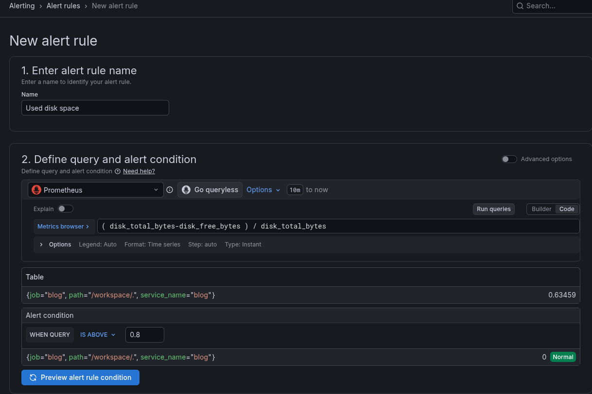

Set folder and evalutation.
* Create a new folder with the `+ New folder` button.
* Select the created folder.
* Create a new evaluation group with the `+ New evaluation group` button.
* Select the created evaluation group.
* Set the pending period to 1 minute and keep the `Keep firing for` option as "None".

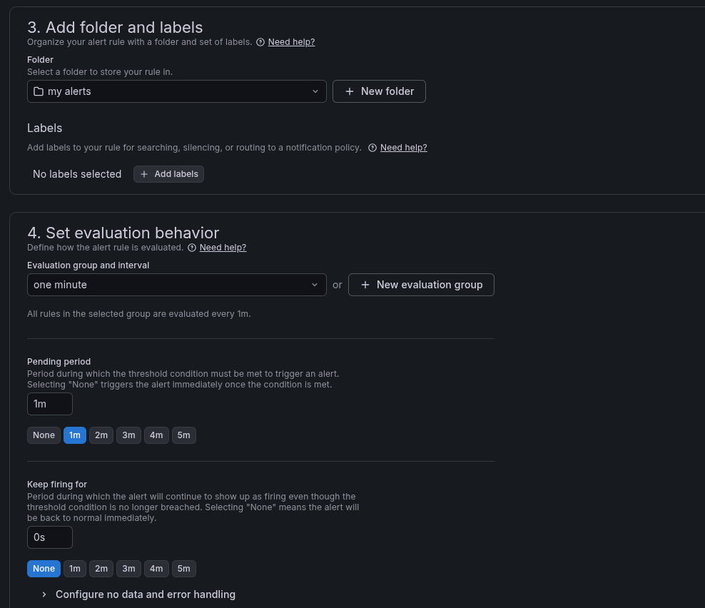

Optionally, the notification message can be customized.

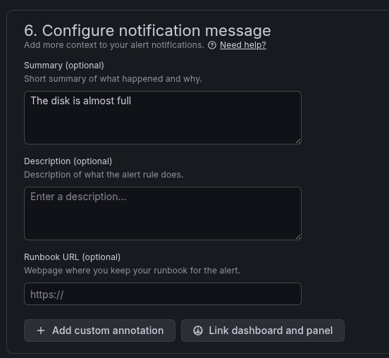
The created alert should be visible in the "alert rules" menu.

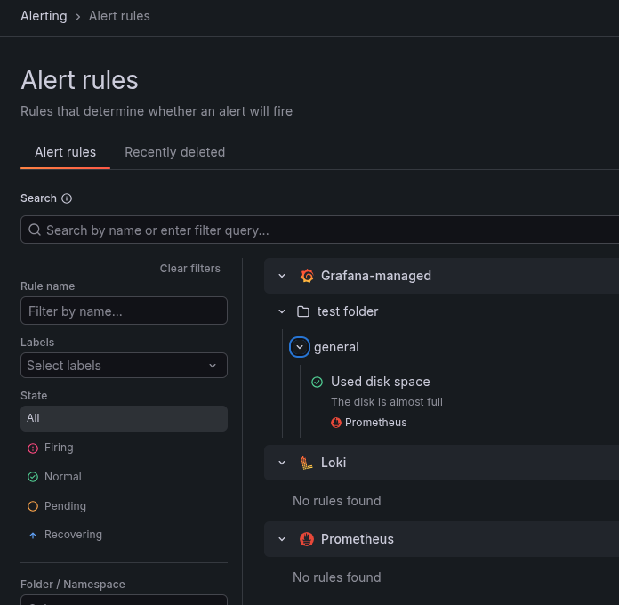

By inspecting the created alert, we can see its current state.

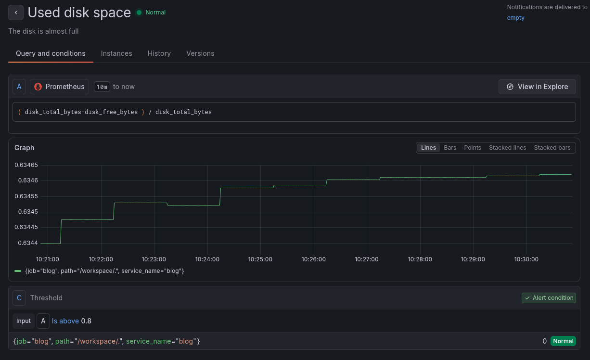

### Request error rate

This is a more complex alert because we have to understand PromQL tables.
Some prometheus metrics, e.g., `http_server_requests_milliseconds_count` are tables.
They contain multiple subcategories that have labels. 

We can filter the requests by status to get the internal errors with this query.
`http_server_requests_milliseconds_count{status="500"}`

The tables can be aggregated by label, for example, we can aggregate the request counts by URI.
```promql
sum by(uri) (
    http_server_requests_milliseconds_count
    )
```

By combining these, we can create a query that calculates the error rate grouped by URI.
[More info about promQL.](metrics.md#prometheus-query-language)

```promql
sum by(uri) (
    rate(http_server_requests_milliseconds_count{status="500"}[$__rate_interval])
    ) 
/ 
sum by(uri) (
    rate(http_server_requests_milliseconds_count[$__rate_interval])
    )
```

This query returns a table that contains the error rate and is labeled by URI.
The grafana alerts evaluate the condition for each table, so a single endpoint of our page
can trigger an alert that contains its own URI.

We can visualize what we are measuring in the "explore" menu.

Here, we can see that the `/500` endpoint has 100% (1) error rate.
This is a testing tool that returns 500 errors for every request.
The other endpoints are not visible because they have no errors.

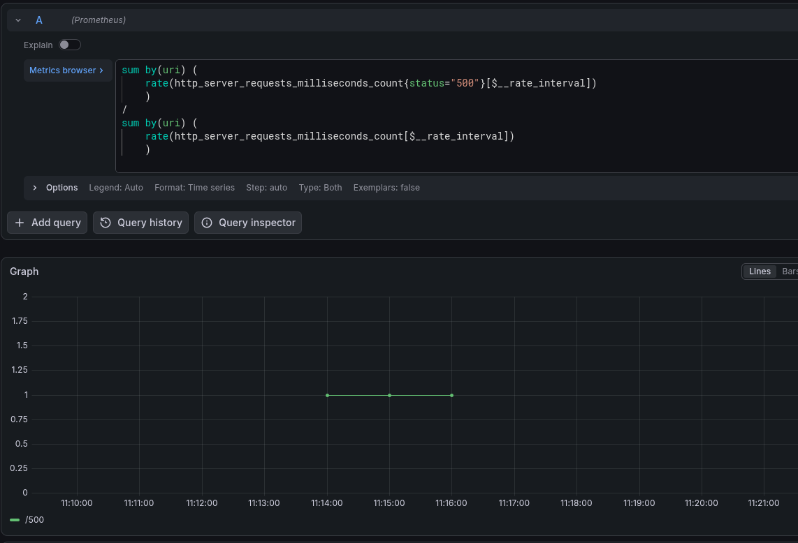

Now we know the query works, and we can create the alert.

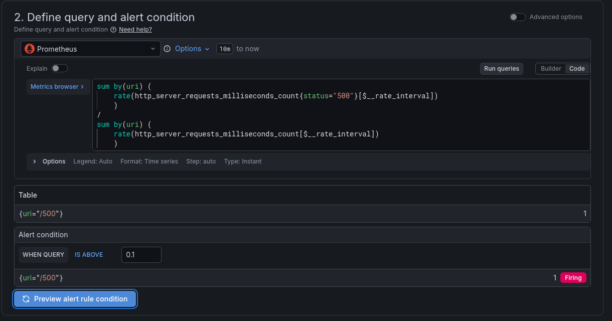

After following the steps of the previous alert, the new alert should be added.

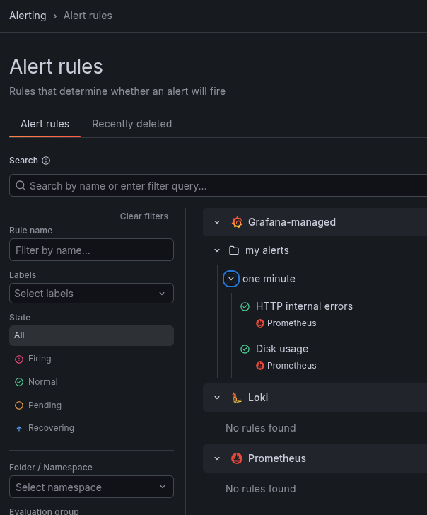

Unlike the disk alert, this one is straightforward to test.
By calling the `/500` endpoint, we can see that the condition is true.
After a short while, the alert should move to "Pending" status.
(We configured a 1-minute evaluation interval.)

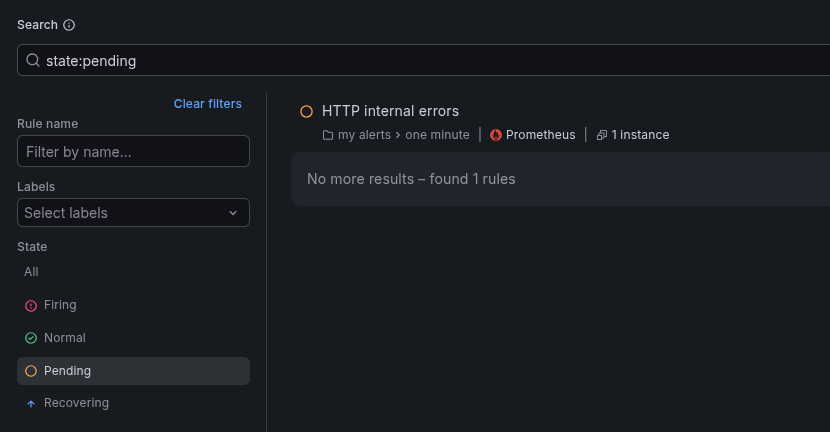

If the condition continues to pass, the alert will move to "Firing" status.
By inspecting the alert, we can see that it waited for the pending time before moving to firing status.

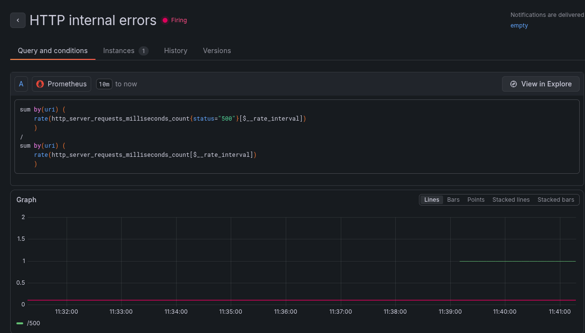

The firing alert sends a notification that se can view at **grafana/alerting/active notifications**.

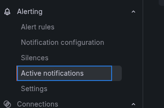

The notification shows which endpoint triggered the alert.

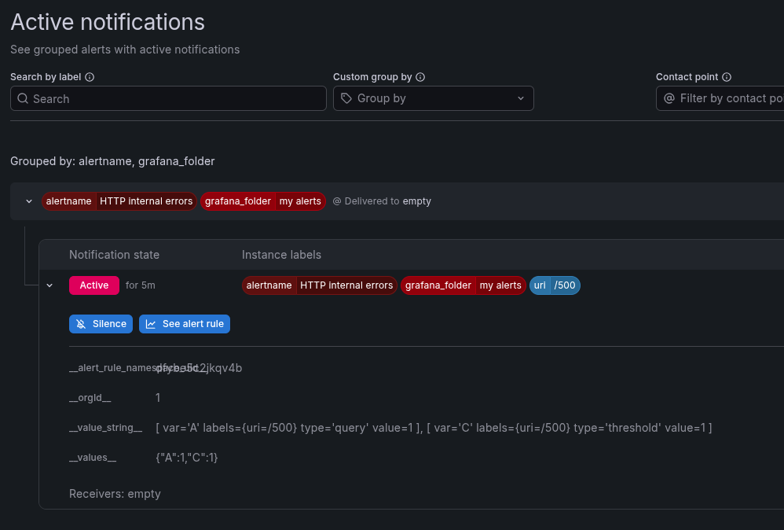

The configured alerts can be exported from the "alert rules" menu.

## Better notifications

We only used the in-app notifications for this tutorial.
Other notifications channels, e.g., email and webhook can be configured.

## Persistence

Rules created through the UI live in Grafana's local state. The Compose files
do not mount a persistent Grafana data directory, so treat UI-created rules as
disposable when the `lgtm` container is removed (for example by
`docker compose down`). For reproducible shared or production alerting,
provision alert rules, contact points, and notification policies as managed
configuration, and use a persistent Grafana database. Grafana documents both
[creating Grafana-managed alert rules](https://grafana.com/docs/grafana/latest/alerting/unified-alerting/alerting-rules/create-grafana-managed-rule/)
and [provisioning alerting resources](https://grafana.com/docs/grafana/latest/alerting/set-up/provision-alerting-resources/file-provisioning/).

## Further reading

- [Grafana alert-rule concepts](https://grafana.com/docs/grafana/latest/alerting/fundamentals/alert-rules/)
- [Grafana contact points and notification testing](https://grafana.com/docs/grafana/latest/alerting/configure-notifications/manage-contact-points/)
- [Grafana notification policies](https://grafana.com/docs/grafana/latest/alerting/configure-notifications/create-notification-policy/)