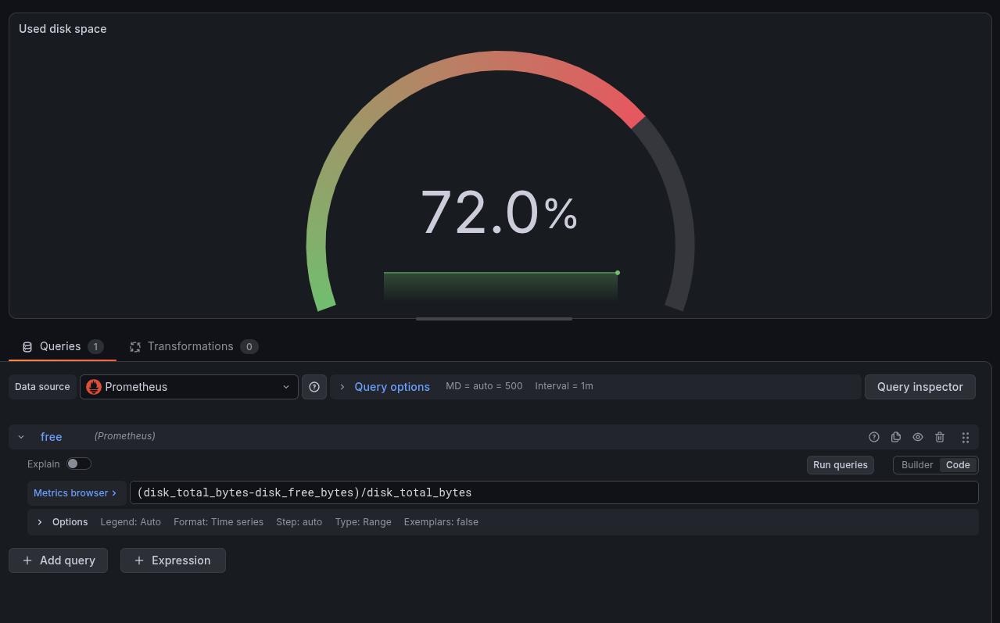
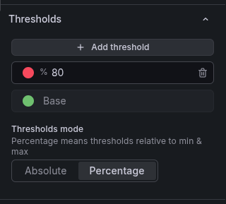
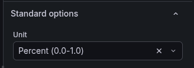
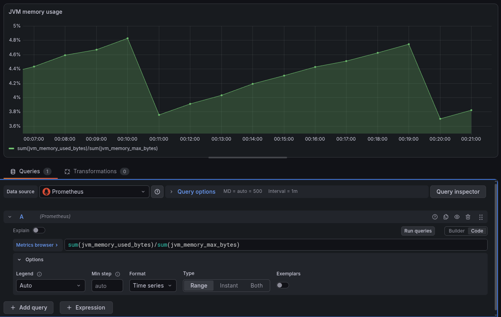
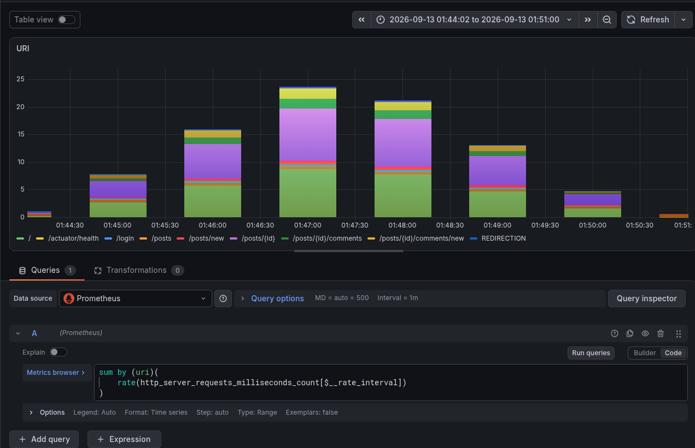
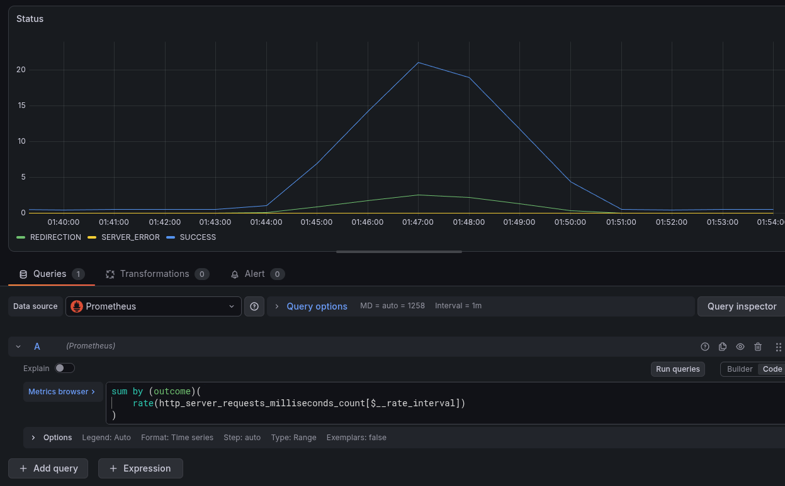
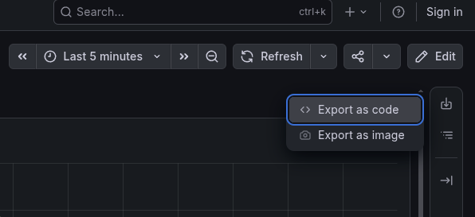
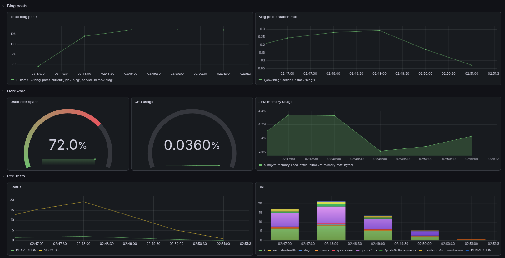

# Dashboard guide

The dashboard of the Grafana UI can record custom widgets.

The widgets can be added from the "explore" and "dashboards" pages.
The drilldown menu cannot add dashboard widgets.

## Add a custom widget

We demonstrate how to add a custom widget from a prometheus query.

### Create a query

This example queries the total blog post count.


### Add to the dashboard

After clicking "add to dashboard" we can define which dashboard to add the widget to.


### Display

Our new dashboard with the custom widget can be viewed in the dashboard menu.


### Best practices

Adding widgets on the dashboard menu instead of the explore menu is usually
more convenient.

## More examples

### Disk usage

To calculate the disk usage, we need to use operations on multiple Prometheus metrics.

This promQL query calculates the usage:

`(disk_total_bytes-disk_free_bytes)/disk_total_bytes`



We can add a threshold to visualize when a value is too high.



The result of the calculation is between 0 and 1, so we use this 0-1 percent unit.



### JVM memory

The JVM memory usage displayer has a similar promQL query to the disk usage.



### Requests

We can count how often an URL is requested, and how often a response status happens.

To achieve this, we must introduce grouping: 
```text
sum by (parameter)(
    *metric*
)
```





### Export

To export a dashboard as a file, select the download icon and "Export as code".

The created JSON file can be imported at "dashboards/new/import".



## Production

In production use, we would have to sum or group the metrics by service instance in addition.

## More info

For more information, check the exact dashboard config by importing the `/dashboard-final.json` file in the Grafana UI.



### Relevant links:
- [PromQL](metrics.md#prometheus-query-language)
- [Filter and group by tutorial by Grafana](https://grafana.com/docs/grafana/latest/visualizations/dashboards/build-dashboards/filter-group-by/)
- [Visualization tutorial by Grafana](https://grafana.com/docs/grafana/latest/visualizations/panels-visualizations/visualizations/)