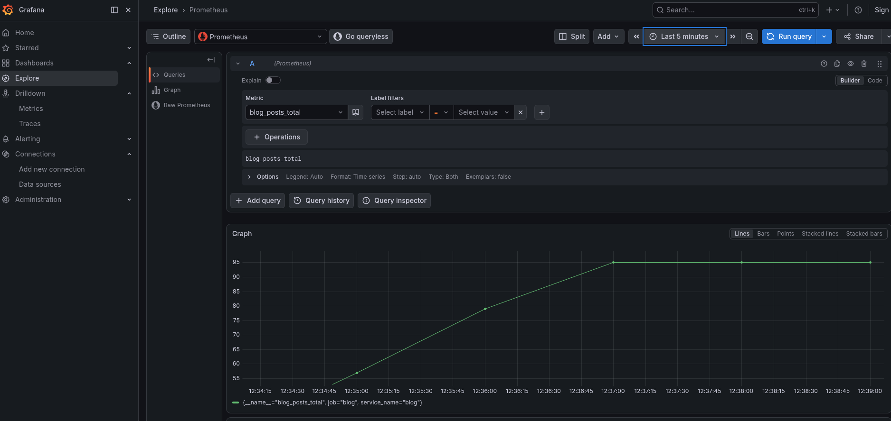
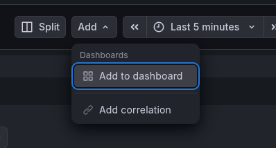

# Dashboard guide

The dashboard of the grafana UI can record custom widgets.

The widgets can be added from the "explore" and "dashboards" pages.
The drilldown menu cannot add dashboard widgets.

## Add a custom widget

We demonstrate how to add a custom widget from a prometheus query.

### Create a query

This example queries the total blog post count.

### Add to the dashboard

After clicking "add to dashboard" we can define which dashboard to add the widget to.

### Display

Our new dashboard with the custom widget can be viewed in the dashboard menu.

