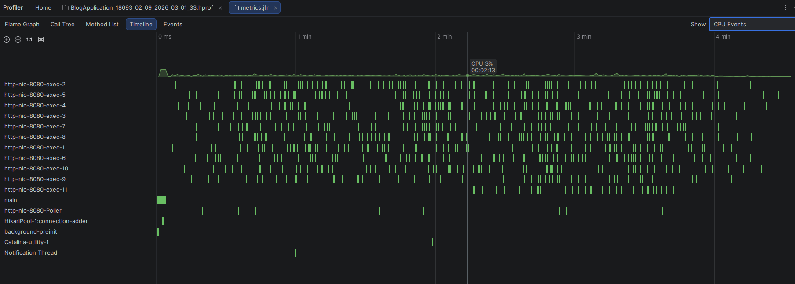

# Java flight recorder guide

Java flight recorder (JFR) is a JVM event profiler built into the JDK.

This tool collects the performance metrics of the function calls.

It can be started with JVM arguments and the `jcmd` CLI tool.

The JCDM CLI is also a part of the JDK. It can execute java-specific commands 
in running java applications.

The standard way for using it is to give the JVM arguments from the CLI
when starting the application and then dump the logs with thd JCMD tool
while the application is running.

## Example usage

This terminal command starts our java application with JFR enabled.  

```
./mvnw spring-boot:run \
    -Dspring-boot.run.jvmArguments='-XX:StartFlightRecording:settings=default,disk=true,maxage=1h,maxsize=256m,name=blog'
```

Here, `settings=default` sets the recording profile.

The recording profile defines how much details JFR collects.

- default: Low impact on performance, fewer details, suitable for production.
- profile: More tracked metrics, more details, higher performance cost. Development only.

The logs can be dumped into a `.jfr` file with the JCMD CLI.

```jcmd BlogApplication JFR.dump name=blog filename=./metrics.jfr```

The CLI can refer to the main class name, or the process ID (PID).
(In this case, we use the main class name `BlogApplication` because it's the same 
between restarts, unlike the PID)

An example JFR dump command that shows the PID is logged when the java application starts with JFR enabled.

The created JFR file can be viewed with IntelliJ IDEA or the [java mission control GUI](https://adoptium.net/jmc).

## Visualization

Intellij



Java mission control (downloaded from the link above)


## Links

- [JFR basic usage on java 8](https://www.baeldung.com/java-flight-recorder-monitoring)