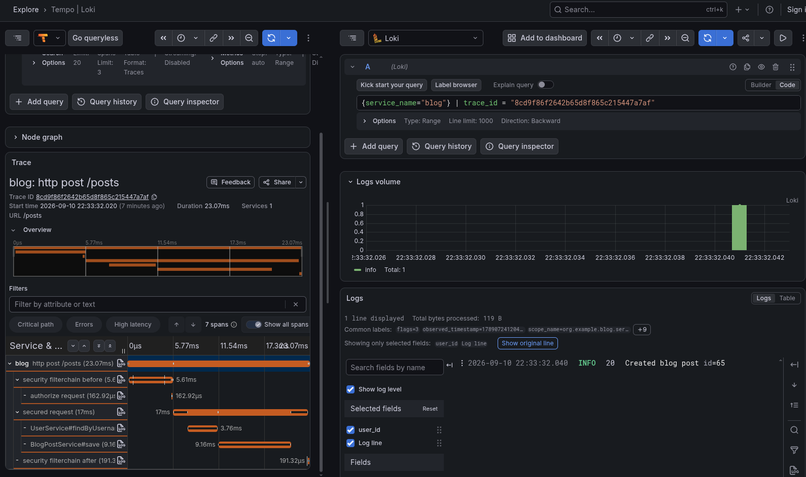

# Logging guide

We are using the loki log database, logback, SLF4J and the open telemetry log format
to create parameterized logs.

These logs carry the trace id, and optionally the user id.

By using these fields we can find the logs of a trace in the
Grafana trace viewer, or query the logs of a selected user.

[Filter logs and traces by user guide](filter_by_user.md)

## Tools

### Loki

The log database of Grafana.

### SLF4J

A backend-independent abstraction for logging.
This log format supports parameterized logs.
[slf4j guide](slf4j.md)

### Logback

A logging backend for SLF4J. 
This processes what happens when we create a log is created.
We use this because the default logs are not parametererized.

### Open telemetry logs

Open telemetry has a format for logs. 
The application is configured to export the logs in this format
for the open telemetry collector.

## Architecture
```text
Log created in java 
v
logback
v
open telemetry converter
v
open telemetry collector
v
loki
```

The Grafana UI queries loki when the logs are viewed. 

## Implementation

We must add the open telemetry logback appender (and logback) to maven.

This library tells logback to forward the logs to open telemetry. (It also includes logback itself.)

(The spring boot open telemetry integration is also a maven package.)

```xml
<dependency>
    <groupId>io.opentelemetry.instrumentation</groupId>
    <artifactId>opentelemetry-logback-appender-1.0</artifactId>
    <version>2.26.1-alpha</version>
</dependency>
```

The appender must be configured at application startup.

```java
import io.opentelemetry.api.OpenTelemetry;
import io.opentelemetry.instrumentation.logback.appender.v1_0.OpenTelemetryAppender;
import org.springframework.beans.factory.InitializingBean;
import org.springframework.stereotype.Component;

/**
 * Connects Logback's OpenTelemetry appender to Spring Boot's OpenTelemetry SDK.
 */
@Component
class OpenTelemetryAppenderInitializer implements InitializingBean {

    private final OpenTelemetry openTelemetry;

    OpenTelemetryAppenderInitializer(OpenTelemetry openTelemetry) {
        this.openTelemetry = openTelemetry;
    }

    @Override
    public void afterPropertiesSet() {
        OpenTelemetryAppender.install(openTelemetry);
    }
}
```

Logback must be configured to use the open telemetry appender, 
and to display the logs on the console.

```xml
<?xml version="1.0" encoding="UTF-8"?>
<configuration>
    <include resource="org/springframework/boot/logging/logback/defaults.xml"/>
    <include resource="org/springframework/boot/logging/logback/console-appender.xml"/>

    <appender name="OTEL" class="io.opentelemetry.instrumentation.logback.appender.v1_0.OpenTelemetryAppender">
        <captureMdcAttributes>user.id</captureMdcAttributes>
    </appender>

    <root level="INFO">
        <appender-ref ref="CONSOLE"/>
        <appender-ref ref="OTEL"/>
    </root>
</configuration>
```

[More info about the logback configuration](slf4j.md#logback-configuration)

## Usage

Locate the `grafana/drilldown/logs` menu on the Grafana UI 
for the simplest way to access the logs.


In the `grafana/drilldown/traces` menu, the logs of a trace span
are displayed when it is selected. 



The logs can be queried with in more complex ways with logQL, a query language
for Loki logs.
[LogQL documentation](https://grafana.com/docs/loki/latest/query/)

## User logs

This project appends the user id to the logs if available to make
the logs of a selected user queryable.

[Filter logs by user id guide](filter_by_user.md#filtering-logs)