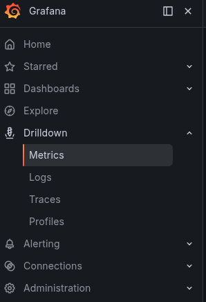
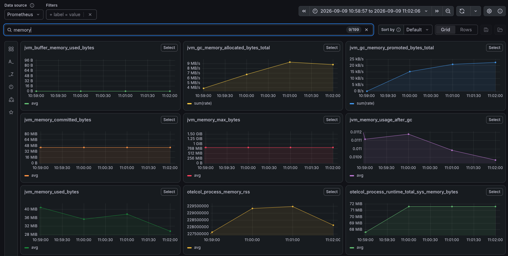
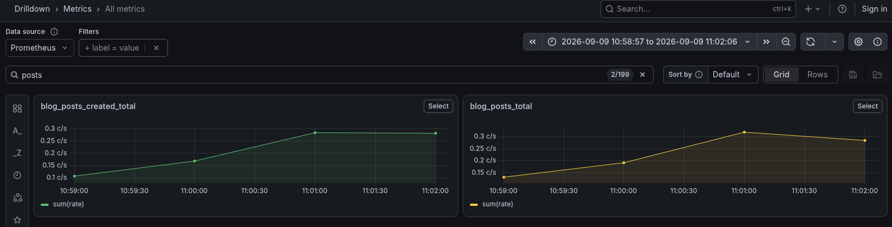

# Tracking metrics

The tracking of the application metrics helps us to inspect the hardware usage and custom
metrics.

These statistics can indicate the application traffic, the number of
users and the remaining hardware capacity.

## Implementation

### Tools

We use spring boot actuator, prometheus and grafana to track metrics.

- Spring boot actuator collects metrics about the application.

- Prometheus is a monitoring system that collects metrics from the application 
and exposes them to the user.

- Grafana is a visualization tool that allows you to visualize the
collected metrics.

### The architecture

- Spring boot actuator collects the metrics and forwards them
to the open telemetry collector.

- The open telemetry collector buffers, formats and forwards the metrics
to the prometheus server.

- The grafana UI queries the prometheus server. 

#### Aggregations
The prometheus servers track metrics per application instance.
The grafana UI does the aggregation.

### Code

#### Configuration

To enable the tracking of metrics, we need to configure the 
open telemetry URL in the application.yml file.

```yaml
management:
  otlp:
    metrics:
      export:
        url: http://localhost:4318/v1/metrics
```

Here, `http://localhost:4318` is the open telemetry collector URL.

We need the `spring-boot-starter-actuator` and `spring-boot-starter-opentelemetry`
packages to be installed.

- The actuator is responsible for collecting the metrics.
- Open telemetry formats and forwards them to the open telemetry
collector.

The hardware metrics are tracked by default.

#### Custom metrics

To track application-specific things such as total post count and created posts per second,
we need to use the `MeterRegistry` class.

Here is a simple example:
```java
import io.micrometer.core.instrument.Counter;
import io.micrometer.core.instrument.Gauge;
import io.micrometer.core.instrument.MeterRegistry;
import org.example.blog.repository.BlogPostRepository;
import org.springframework.scheduling.annotation.Scheduled;
import org.springframework.stereotype.Repository;

@Repository
public class BlogPostMetrics {
    private final BlogPostRepository posts;
    private final Counter blogPostsCreatedCounter;
    private long totalPosts;

    public BlogPostMetrics(BlogPostRepository posts, MeterRegistry registry) {
        this.posts = posts;

        // total posts gauge
        /*
        Beware of the naming conventions.
        "blog.posts.current" is displayed as gauge in the drilldown menu of the grafana UI
        while "blog.posts.total" is displayed as counter (rate).

        While the dashboard can define and save custom display formats, displaying
        the correct format in the drilldown menu is convenient.
        */
        Gauge.builder("blog.posts.current", () -> totalPosts)
                .description("Current number of blog posts")
                .register(registry);

        // posts created counter
        this.blogPostsCreatedCounter = Counter.builder("blog.posts.created")
                .description("Number of blog posts created")
                .register(registry);
    }

    /*
    The count is re-calculated independently of the actuator reporting rate because
    expensive database queries should not depend on this polling rate.

    In distributed systems, this query would run for each instance.
    To avoid this, the simplest way is to use a separate server for the global gauges.

    Counting all rows periodically is not recommended for production.
     */
    @Scheduled(fixedDelay = 15_000)
    void updateTotalCount() {
        totalPosts = posts.count();
    }

    public void incrementBlogPostsCreatedCounter() {
        blogPostsCreatedCounter.increment();
    }
}

```

- The total posts gauge is used automatically by the spring boot actuator.
- The posts created counter is used manually by calling `incrementBlogPostsCreatedCounter`
when a new post is created.

The names are converted to lowercase and dots are replaced with underscores in grafana.
For example, `blog.posts.total` becomes `blog_posts_total`.

More info about custom metrics, their behavior in distributed systems
and best practices can be found in the [custom metrics guide](custom_metrics.md).

## Visualization

The grafana UI displays the metrics in the dashboard.

### The metrics menu
After opening the grafana UI, open 'grafana/drilldown/metrics' to see the metrics.



### Filtering
We can search for metrics by name.



### Custom metrics
We can also see the custom metrics that we have created.



## Prometheus query language

Prometheus can manually query the metrics by using the prometheus query language (promQL).

This is accessible in the "grafana/explore/prometheus" menu of the
grafana UI.

[PromQL documentation](https://grafana.com/docs/grafana/latest/datasources/prometheus/query-editor/)

Custom query result can also be used as dashboard widgets. See: [dashboard guide](dashboard.md)

