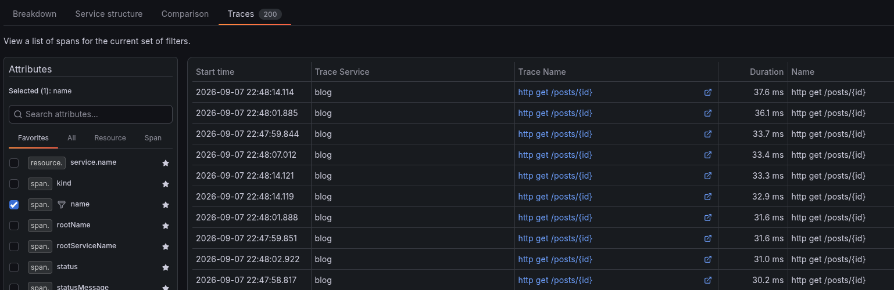
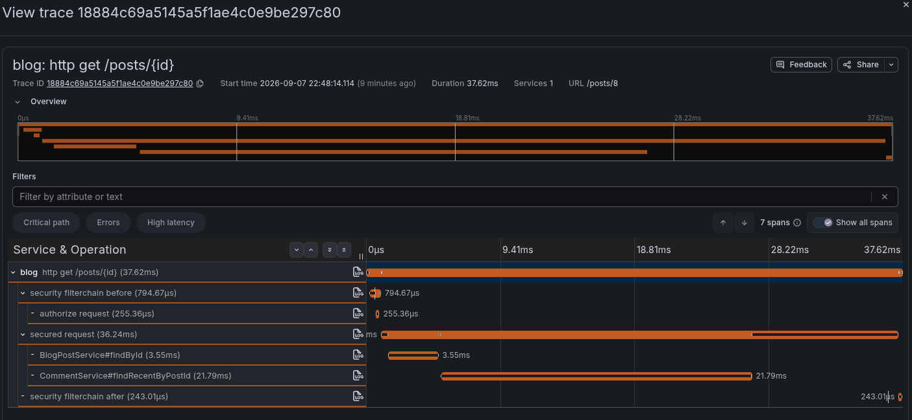

# Request tracing guide

## Introduction

Request tracing means to observe how much time the significant functions
contributed to the request duration.

With this, we can see which functions would worth to optimize.

## Building parts

- Inside Java:
  - Instrumentation: The tool that generates the traces.
  - Bridge: How the outgoing traces are formatted.
- Trace ingestion:
  - Collector: A server that collect, buffers, and routes the traces
  to other services.
  - Trace storage: A database that stores the generated traces.
- Visualization: A web UI that displays the traces for humans.

## Important definitions

- Span: The duration of an observed function. Can be nested.
- Trace: Group of related spans, a single web request.

## Tools

Multiple tools can implement the described building parts.

These tools can be combined in many ways. 

We use the modern and simplest approach.
The choices of the project are highlighted with **bold** text.

- Instrumentation:
  - **Spring micrometer tracing**
  - Open telemetry instrumentation
    - Spring boot plugin
    - Java agent
- Bridge:
  - **Open telemetry "OTLP" bridge**
  - Openzipkin brave bridge
- Trace ingestion:
  - **Open telemetry collector** 
  - Zipkin collector
- Trace storage:
  - **Grafana tempo**
  - Zipkin database
- UI
  - **Grafana UI**
  - Zipkin UI

The project chose the spring boot micrometer + open telemetry + Grafana combination.

### LGTM
TODO separate
For the simplest setup, the Grafana LGTM docker image is the best.
This image contains pre-configured open telemetry collector, 
tempo, UI, and other services those are not relevant now.

This is a developer convenience that should not be used in production. 
In production, the listed services should be independent containers to
enable scaling.

For the scalable container setup, see: *coming soon*

### Technical implementation of the selected tools:

- Spring micrometer tracing: included in `spring-boot-starter-actuator`
- OTLP bridge: included in `spring-boot-starter-opentelemetry`
- Open telemetry collector: included in LGTM
- Grafana tempo: included in LGTM
- Grafana UI: included in LGTM

Application configuration:
```yaml
management:

  tracing:
    sampling:
      probability: 1.0 
      # How much of the requests are traced (1=all, 0=none)
      # 1 is development only. 
      # 0.1 id recommended for production by spring.

  opentelemetry:
    tracing:
      export:
        otlp:
          endpoint: http://localhost:4318/v1/traces
          # The URL of the open telemetry collector in LGTM (or elsewhere)

  observations:
    annotations:
      enabled: true 
      # This enables the @Observed annotations, otherwise they are ignored.
      # Most functions are not traced b default.
      # The @Observed annotation marks a function for tracing.
      # It's used on functions those are excepted to take a significant time.
```

## Usage

To start the app with tracing, the LGTM and the postres container must
run before the java application.

The simplest way to start everything is to use the all-in-one compose file that
starts the java app, the database, LGTM and a K6 test.

K6 generates artificial traffic to create displayable metrics.
See: [K6 guides](../../k6/k6_index.md)

Run `docker compose -f blog/compose-observation.yaml up` or start
the compose file from the IDE.

## Grafana UI

Introduction to the grafana UI.

### Traces
To view the traces, navigate to *left menu / drilldown / traces*.


### Filtering
In the traces menu, the *breakdown / attributes / favorites / name* section can filter
by endpoint.

Click "include" on the selected endpoint to filter.


### Request history
Switching from breakdown to traces displays individual request traces
ordered by duration by default.

A trace can be opened by clicking the blue link.

Clicking the open icon will display the request in a separate window.


### A single trace
After opening a trace in the previous step, the function time spans are visible.


## Links
- [Micrometer tracing documentation and examples by spring](https://docs.spring.io/spring-boot/reference/actuator/tracing.html)
- [Open telemetry tracing in spring boot tutorial](https://spring.io/blog/2025/11/18/opentelemetry-with-spring-boot)
- [Spring micrometer tracing home page](https://docs.micrometer.io/tracing/reference/)
- [Grafana docker LGTM home page](https://grafana.com/docs/opentelemetry/docker-lgtm/)
- [Grafana docker OTEL LGTM github](https://github.com/grafana/docker-otel-lgtm)
- [Micrometer tracing guide by spring](https://docs.spring.io/spring-boot/reference/actuator/tracing.html)
- [Micrometer tracing documentation](https://docs.micrometer.io/tracing/reference/)