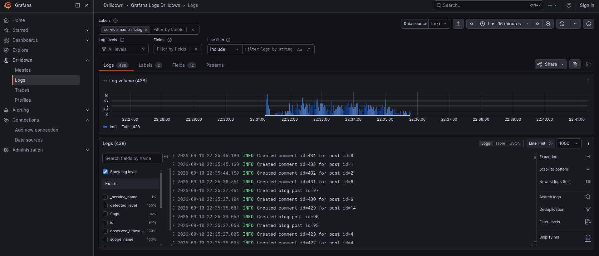
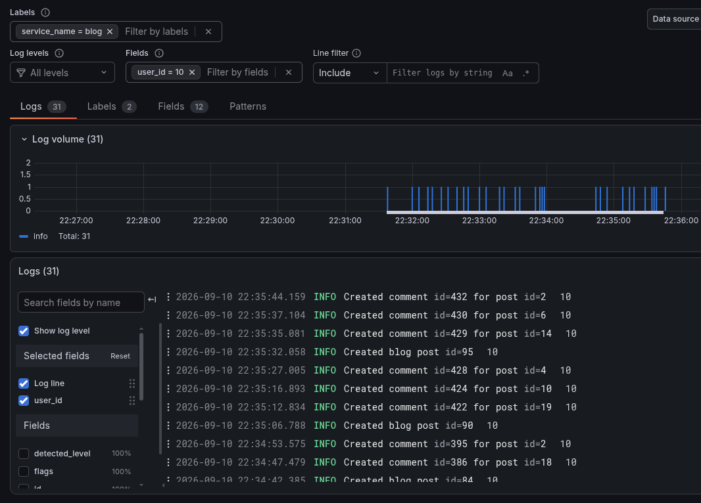
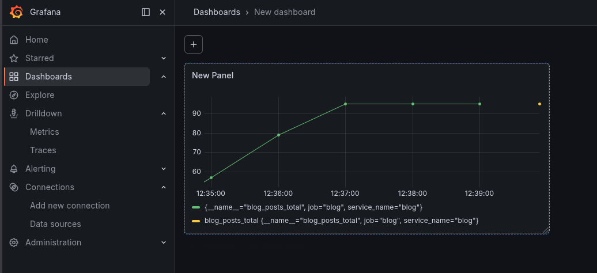
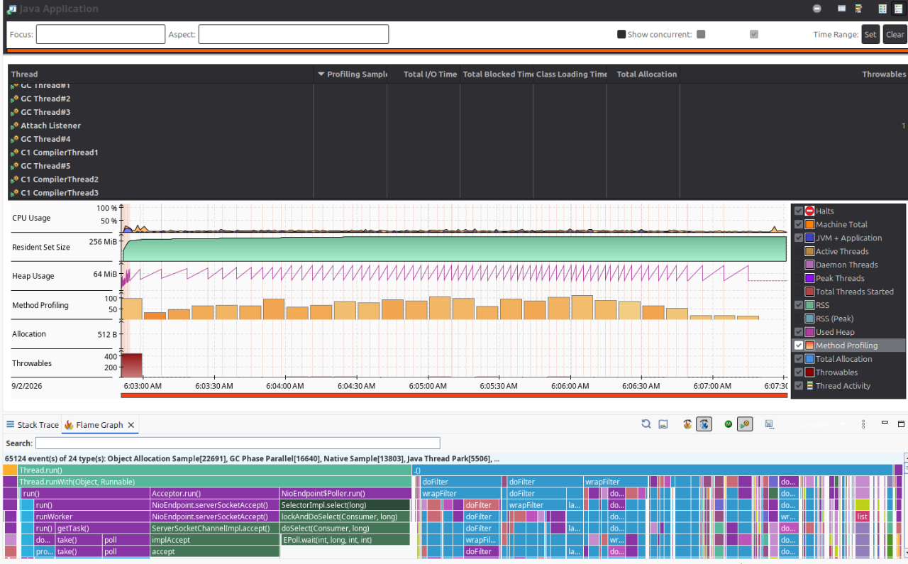

# Summary

This project demonstrates the usage of **observability** tools.

We generate traffic for the blog application and inspect the performance
metrics via the observation tools.

Main parts:
- Blog application: A sample blog application with java, postgres and [thymeleaf](blog/guides/thymeleaf.md).
- Observation tools: Services for observing and visualizing metrics. 
- Load tester: Realistic web traffic generator with K6.

We are using the Grafana observation toolkit with spring boot micrometer.
This unifies the creation and visualization of multiple metrics.

## Observation technologies

The project uses spring boot micrometer, open telemetry format, and
the Grafana ecosystem.

These tools are often used together, 
[this third party tutorial](https://www.danvega.dev/blog/opentelemetry-spring-boot) 
builds a similar project.

This project is using the following observation tools:

### Request time traces

This tells us how much time the functions contributed to the request duration.


Relevant tools:
- Open telemetry
- Grafana tempo
- Grafana UI

Relevant article:
[Request tracing guide](blog/guides/tracing.md)

### Performance metrics 

Tracking the hardware usage of the application and custom metrics.


Relevant article: [Metrics guide](blog/guides/metrics.md)

### Structured logs

The logs are parameterized, they are stored externally and they can be
queried in many ways.



### Filtering by user

The user id is appended to logs and traces to make it possible to retrieve
all actions of a user chronologically.



### Database metrics

*coming soon*

### Custom dashboards

The grafana UI allows the creation of custom dashboards.



Relevant article: [Custom dashboard guide](blog/guides/dashboard.md)

### K6 metrics

Apart from generating traffic, K6 tracks request durations, 
success rates and the result of the checks.

```json
{
  "root_group": {
    "name": "",
    "path": "",
    "id": "d41d8cd98f00b204e9800998ecf8427e",
    "groups": {},
    "checks": {
      "form page loaded": {
        "path": "::form page loaded",
        "id": "548b7a52704ae4e112233b06b3012d90",
        "passes": 528,
        "fails": 0,
        "name": "form page loaded"
      },
      "CSRF token found": {
        "fails": 0,
        "name": "CSRF token found",
        "path": "::CSRF token found",
        "id": "460c56e060ee8119886daf8469b695da",
        "passes": 528
      },
      "status was 200": {
        "name": "status was 200",
        "path": "::status was 200",
        "id": "1461660757a913d4fb82ac4c5e1009de",
        "passes": 3877,
        "fails": 0
      }
    }
  }
}
```

Relevant article: [K6 guides](k6/k6_index.md)

### Java flight recorder

Java flight recorder (JFR) is a hardware usage tracking tool
that is built into the JDK.

The difference between the spring boot micrometer hardware metrics and JFR
is that JFR tracks CPU usage per function while micrometer is global. 
Also, JFR lacks a streamlined way for continuous distributed logging and persistence.



Relevant articles: [JFR guide](blog/guides/java_flight_recorder.md)