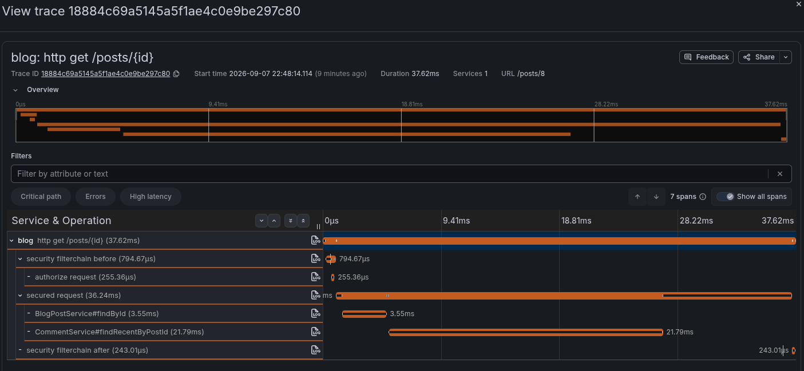

# Summary

This project demonstrates the usage of **observability** tools.

We generate traffic for the blog application and inspect the performance
metrics via the observation tools.

Main parts:
- Blog application: A sample blog application with java and [thymeleaf](blog/guides/thymeleaf.md).
- Observation tools: Services for observing and visualizing metrics. 
- Load tester: Realistic web traffic generator with K6.

We are using the Grafana observation toolkit that unifies the creation 
and visualization of multiple metrics.

## Observation technologies

The following observation tools are used in the project:

### Request time traces

This tells us how much time the functions contributed to the request duration.



Relevant tools:
- Open telemetry
- Grafana tempo
- Grafana UI

Relevant article:
[Request tracing guide](blog/guides/tracing.md)

### Queryable logs 

*coming soon*

### Performance metrics 

*coming soon*

### Database metrics

*coming soon*

### K6 metrics

Apart from generating traffic, K6 tracks request durations, 
success rates and the result of the checks (if any).

```json
*result.json*
```

Relevant article: [K6 guides](k6/k6_index.md)

### Java flight recorder

Java flight recorder (JFR) is a hardware usage tracking tool
that is built into the JDK.

It is less useful in a realistic scenario than request durations.

This tool does not have a streamlined approach for collecting and 
persisting logs. It is more of a development-only tool.

*jfr images*

Relevant articles: [JFR guide](blog/guides/java_flight_recorder.md)